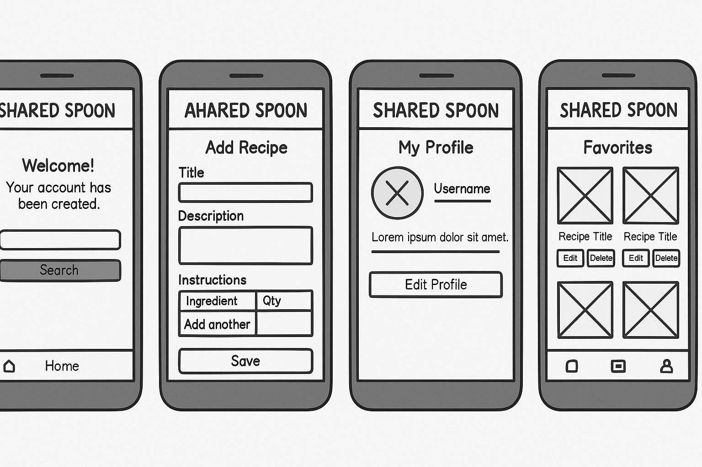
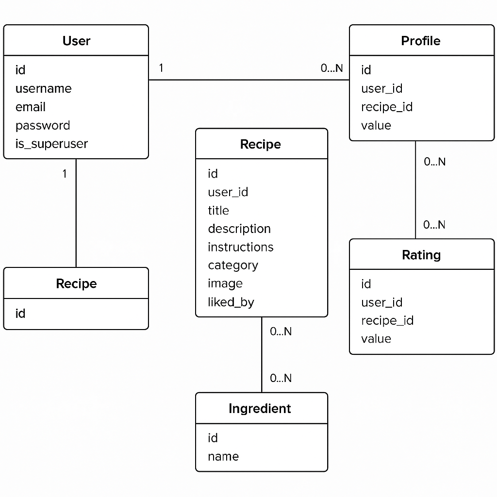

# Shared Spoon 🍴


**Shared Spoon** is a full-stack recipe web application where users can register, log in, add recipes, browse others’ creations, and mark their favorites. Built using Django and PostgreSQL, it features responsive design, dynamic ingredient search using Select2, user profiles with avatars, and dark mode toggle for a personalized experience.

🔗 [Live Site](https://shared-spoon-f2d629a69afc.herokuapp.com)  
💻 [GitHub Repository](https://github.com/martiiann/shared-spoon)

---

## 📚 Table of Contents

- [Responsive Overview](#-responsive-overview)
- [Page Overviews](#-page-overviews)
- [Wireframes](#-wireframes)
- [Database Design (ERD)](#️-database-design-erd)
- [Features](#-features)
- [Functionality Overview](#-functionality-overview)
- [Manual Testing Table](#-manual-testing-table)
- [First-Time Visitor Goals](#-first-time-visitor-goals)
- [Returning Visitor Goals](#-returning-visitor-goals)
- [Design](#-design)
- [Validator Testing](#-validator-testing)
- [Performance](#-performance)
- [Devices Tested](#-devices-tested)
- [Browser Compatibility](#-browser-compatibility)
- [Future Features](#-future-features)
- [Deployment](#-deployment)
- [Debugging & Problem Solving](#-debugging--problem-solving)
- [Lessons Learned](#-lessons-learned)
- [Acknowledgments](#-acknowledgments)

---

## 📱 Responsive Overview

> **Note**: Mobile, tablet, and desktop views are tested manually and verified for responsiveness.

| Mobile View | Tablet View | Desktop View |
|-------------|-------------|--------------|
|  |  |  |

---

## 🧭 Page Overviews

### 🏠 Home Page


### 👤 My Profile


### ➕ Add Recipe


### ❤️ My Favorites


### 📓 My Recipes


---

## 🧩 Wireframes

> All wireframes reflect initial design planning. Some elements in the final implementation may differ slightly due to design improvements made during development.

### Home Page


### Add Recipe


### My Recipes


### Profile


### Recipe Detail


---

### Mobile Layout (Responsive Design)



> Responsiveness was verified manually on iPhone, Android, and tablet devices and confirmed to match layout expectations.

---

## 🗃️ Database Design (ERD)

The following Entity Relationship Diagram (ERD) outlines the structure of the database, including models and relationships such as one-to-one, one-to-many, and many-to-many connections.




---

## ✨ Features

- **User Authentication**: Register, login, and logout.
- **CRUD Recipes**: Add, update, delete recipes.
- **Favorites**: Users can save and manage favorites.
- **Profile Page**: Avatar upload, view own activity.
- **Searchable Ingredients**: AJAX-powered Select2 dropdown.
- **Dark Mode**: Toggle available for all users.
- **Responsive Design**: Mobile-first layout.
- **Pagination**: For recipe listings.

---

## 🧮 Functionality Overview

| Feature                        | Description                                                                |
|-------------------------------|-----------------------------------------------------------------------------|
| Add Recipe                    | Title, category, image, instructions, and ingredients using formsets        |
| Ingredient Search             | AJAX-powered with Select2, results dynamically returned                     |
| Save Favorite                 | One-click save/unsave to personal list                                      |
| Dark Mode Toggle              | Retains preference via `localStorage`                                       |
| Profile Page                  | User recipes, avatar, bio                                                   |
| Admin Dashboard               | Available to superusers for moderation                                      |

---

## ✅ Manual Testing Table

| Feature                       | Test Description                                 | Expected Outcome                              | Status     |
|-------------------------------|--------------------------------------------------|-----------------------------------------------|------------|
| Register User                 | Fill and submit form                             | New user created, redirected, success message | Pass       |
| Login                         | Submit valid credentials                         | Logged in, redirected to home                 | Pass       |
| Invalid Login                 | Submit incorrect password                        | Error message shown, login fails              | Pass       |
| Logout                        | Click logout button                              | User logged out, flash message shown          | Pass       |
| Add Recipe                    | Submit form with ingredients                     | Recipe saved, flash message shown             | Pass       |
| Edit Recipe                   | Change fields and save                           | Recipe updates, flash message shown           | Pass       |
| Delete Recipe                 | Confirm deletion via modal                       | Recipe removed, flash message shown           | Pass       |
| Delete Recipe Cancel          | Click delete, then cancel modal                  | Recipe not deleted                            | Pass       |
| Favorite Toggle               | Click heart icon                                 | Recipe added/removed from favorites           | Pass       |
| Favorite Persistency          | Favorite recipe, reload page                     | Heart icon remains filled                     | Pass       |
| Ingredient Search             | Type “sugar” in ingredient field                 | Relevant results dynamically displayed        | Pass       |
| Add Multiple Ingredients      | Add several items using formset                  | All show on recipe after submission           | Pass       |
| Update Profile                | Upload avatar, edit bio/location, submit         | Changes saved, flash message shown            | Pass       |
| Add Profile Image             | Upload a valid image file                        | Avatar preview updates                        | Pass       |
| Invalid Avatar Upload         | Try uploading `.txt` as avatar                   | Error message shown                           | Pass       |
| Mobile Layout                 | Open site on iPhone / Samsung                    | Fully responsive layout                       | Pass       |
| Tablet Layout                 | Open site on iPad / Android tablet               | Scales and functions properly                 | Pass       |
| Desktop Layout                | View site on 1920x1080 screen                    | Layout centered and stable                    | Pass       |
| Dark Mode                     | Toggle switch                                    | Dark theme applied, remembered on reload      | Pass       |
| Rating Updates                | Rate recipe and change value                     | Rating updates without page reload            | Pass       |
| Unauthorized Edit Attempt     | Try editing another user’s recipe via URL        | Access denied or redirected                   | Pass       |
| Admin Login                   | Log in as superuser                              | Access admin dashboard                        | Pass       |
| Pagination                    | View recipe list and use pagination links        | Next/previous pages load correctly            | Pass       |

---

## 🔬 Additional Testing (CRUD, Edge Cases, Validation)

### 🧪 CRUD Functionality Testing

| Action  | Feature Tested     | Method                                                       | Expected Result                          | Status |
|---------|--------------------|--------------------------------------------------------------|-------------------------------------------|--------|
| Create  | Add Recipe         | Fill recipe form with valid input and submit                 | Recipe added, success message shown       | ✅     |
| Read    | View Recipe Detail | Click on a recipe from home or profile                       | Recipe details shown correctly            | ✅     |
| Update  | Edit Recipe        | Click "Edit" on own recipe, change fields, save              | Recipe updated, success message shown     | ✅     |
| Delete  | Delete Recipe      | Click "Delete" and confirm in modal                          | Recipe deleted, success message shown     | ✅     |

---

### ❌ Negative Testing Examples

| Scenario                              | Action Taken                                              | Expected Behavior                                      | Status |
|---------------------------------------|-----------------------------------------------------------|--------------------------------------------------------|--------|
| Empty Recipe Form                     | Submit form without filling required fields               | Error messages shown next to empty fields              | ✅     |
| Invalid Avatar Upload                 | Try uploading a `.txt` file as avatar                     | Form displays validation error                         | ✅     |
| Unauthorized Edit Attempt             | Manually change URL to edit another user's recipe         | 403 Forbidden error or redirect                        | ✅     |
| Delete without Confirmation           | Try to delete recipe without submitting confirmation modal| Recipe not deleted                                     | ✅     |
| Duplicate Rating                      | Rate same recipe again                                    | Old rating updated, not duplicated                     | ✅     |

---

### 🔔 User Feedback

Flash messages (via Django’s `messages` framework) are shown after key user actions to inform users of success or failure. These include:

- ✅ Registering, logging in, or logging out
- ✅ Adding, editing, or deleting a recipe
- ✅ Saving or removing a favorite
- ✅ Updating profile details

These messages are styled using Bootstrap alert components for visibility.

---

### 🛑 Data Protection

- ✅ Users are shown a **confirmation modal** before deleting a recipe to prevent accidental loss.
- ✅ Only the owner of the recipe can update or delete it.
- ✅ Admins have the ability to view and manage all recipes and users through a dedicated admin dashboard.
- ✅ CSRF protection is enabled site-wide via Django middleware.

---

## 🎯 First-Time Visitor Goals

- Understand what the platform does upon landing.
- Explore recent and popular recipes.
- View single recipe details without account.
- Use search to quickly find relevant dishes.
- Easily register an account to contribute recipes.

---

## Returning Visitor Goals

- Log in and access saved (favorite) recipes.
- Add or manage personal recipes.
- Update profile with avatar and bio.
- Search by ingredients and categories.

---

## 🎨 Design

- **Font**: 'Quicksand' via Google Fonts. This font was chosen for its clean, modern, and friendly appearance, which aligns with the approachable and user-focused experience of the recipe-sharing platform.
- **Color Theme**: Earthy tones with Bootstrap support. The color palette was selected to reflect a natural, homemade feel that matches the cooking theme while maintaining readability and contrast.
- **Color Palette Tool**: Palette was designed using [Coolors](https://coolors.co/) to ensure accessible color contrast and visual harmony.
- **Dark Mode**: Uses `body.dark-mode` class to switch palette. This ensures a better experience for users in low-light environments and improves accessibility.
- **Buttons & Cards**: Styled with consistent Bootstrap 5 and custom shadows to maintain visual hierarchy and interactivity across different screen sizes.
- **CSS**: Clean, commented, and organized by sections (base, dark mode, recipe cards, forms) to support maintainability and scalability.

---

## 🧪 Validator Testing

### ✅ HTML Validation
Validated via W3C Validator

- 
- 
- 
- 
- 
- 

### ✅ CSS Validation  
- 

### ✅ JavaScript Validation (JSHint)
- 
- 
- 
- 
- 

### ✅ Python Validation (Code Institute Linter)
- 
- 
- 
- 

---

## 🚀 Performance

Tested via Google Lighthouse  


- **Performance**: 96%
- **Accessibility**: 88%
- **Best Practices**: 93%
- **SEO**: 91%

---

## 📱 Devices Tested

The following devices were used to test responsiveness:

- **Mobile**: iPhone 16, iPhone 15, Samsung Galaxy S23 Ultra  
- **Tablet**: iPad Air, Xiaomi Redmi Tab Pro  
- **Desktop**: MacBook Pro, Windows PC (1920x1080 resolution)

### Results

- **Mobile**: All elements were displayed correctly, and the layout was adjusted to fit the smaller screen. Navigation, buttons, and functionality were fully operational. **Works as expected.**
- **Tablet**: The site scaled perfectly for medium-sized screens, maintaining visual hierarchy and ease of navigation. **Works as expected.**
- **Desktop**: The full layout was displayed as intended, with no visual or functional issues. **Works as expected.**

---

### 🌐 Browser Compatibility

The application was tested on the following browsers to ensure consistent layout, responsiveness, and functionality:

- Google Chrome (desktop & mobile)
- Mozilla Firefox
- Safari (macOS and iOS)

All core functionality — including authentication, form handling, dark mode toggle, and dynamic elements — performed as expected across all browsers tested.

---

## 💡 Future Features

- Recipe commenting and discussions
- User-to-user following system
- Dietary filters (vegan, gluten-free)
- Shareable recipe links with previews

---

## 🛠️ Deployment

The Shared Spoon project was deployed to [Heroku](https://www.heroku.com/) using the following process:

### 🔧 Local Setup & Cloning

1. Cloning the Repository  
Open a terminal and run:  
`git clone https://github.com/martiiann/shared-spoon.git`  
`cd shared-spoon`

2. Create and Activate a Virtual Environment  
`python3 -m venv venv`  
`source venv/bin/activate` (Unix/Mac)  
`venv\Scripts\activate` (Windows)

3. Install Required Dependencies  
`pip install -r requirements.txt`

4. Set Up Environment Variables  
Create an `env.py` file with the following:  
```python
import os  
os.environ['SECRET_KEY'] = 'your_secret_key'  
os.environ['DATABASE_URL'] = 'your_postgres_url'  
os.environ['CLOUDINARY_URL'] = 'your_cloudinary_url'  
```

5. Database Setup  
`python manage.py makemigrations`  
`python manage.py migrate`

6. Create a Superuser  
`python manage.py createsuperuser`

7. Collect Static Files  
`python manage.py collectstatic`

---

### ☁️ Heroku Deployment Steps

1. Create a New Heroku App  
Go to the Heroku dashboard → "New" → "Create new app" → set your app name and region.

2. Connect GitHub Repository  
Under the Deploy tab, connect to GitHub and select the repository.

3. Set Config Vars  
In the Heroku dashboard, go to Settings → Config Vars. Add the following:  
- `SECRET_KEY`  
- `DATABASE_URL`  
- `CLOUDINARY_URL`

4. Push to Heroku  
Run the following:  
`git push heroku main`

5. Disable Debug and Set Allowed Hosts  
In `settings.py`, make sure the following are set:  
```python
DEBUG = False  
ALLOWED_HOSTS = ['shared-spoon-f2d629a69afc.herokuapp.com', 'localhost']  
```

6. Final Checks  
Ensure there is no commented-out code.  
Confirm flash messages work on login, logout, and CRUD actions.  
Test all user functionality, static/media files, and responsiveness on Heroku.

---

### 🌐 Live Site

🔗 [https://shared-spoon-f2d629a69afc.herokuapp.com](https://shared-spoon-f2d629a69afc.herokuapp.com)  
📁 [GitHub Repository](https://github.com/martiiann/shared-spoon)

---

## 🐞 Debugging & Problem Solving

During development, I encountered and resolved several issues using Chrome DevTools, Django logs, and Heroku CLI. Key fixes included:

- **AJAX Ingredient Search**: Corrected a CSRF token issue and adjusted `data-url` in the dynamic form.
- **Static Files on Heroku**: Solved by setting up Whitenoise, ensuring `collectstatic` ran, and configuring `STATIC_ROOT`.
- **Formset Save Errors**: Fixed by using `commit=False` and linking child form data to the parent `Recipe` object.
- **404 on Recipe Detail**: Traced to a missing `pk` in the URL — resolved with the correct pattern and view query.

Tools used included `console.log()`, Django’s debug messages, and `heroku logs --tail`.

---

## 🧠 Lessons Learned

This project deepened my understanding of Django and full-stack development. I learned how to:

- Build dynamic, user-friendly forms with formsets and Select2
- Use AJAX to enhance user experience in real-time without page reloads
- Implement responsive layouts using Bootstrap and dark mode customization
- Store media and sensitive data securely in production using environment variables
- Test, validate, and deploy a fully functional site on Heroku

If given more time, I would further expand features such as recipe commenting and a user-following system. This project helped me build confidence in deploying secure, scalable, and user-centered web applications.

---

## Acknowledgments
- Special thanks to my mentors **Marko** and **Moritz** for their invaluable guidance throughout my project.
- I would like to thank the tutor support team at **Code Institute** for their assistance.
- A big thank you to the entire **Code Institute** for providing me with the opportunity to attend this course and work on this project.